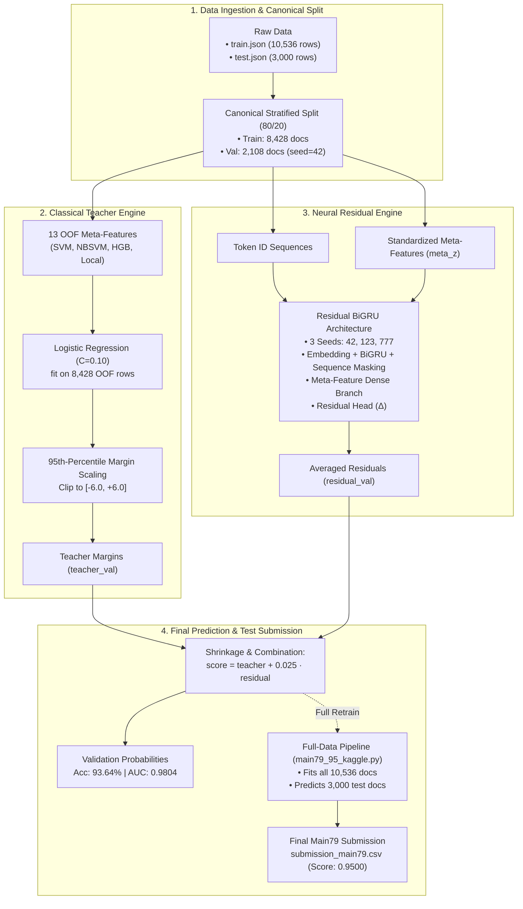

# 🚀 Main79 Engine — Classical Teacher + Neural Residual Ensemble

> **ML4CPMS Project 1:** Human vs. Machine-Generated Text Classification (Kaggle)  
> **Standalone Notebook:** [`Main79_Classical_Residual_Engine.ipynb`](./Main79_Classical_Residual_Engine.ipynb)

---

## 📊 1. Quick Visual Summary

```
┌────────────────────────────────────────────────────────────────────────────────────────┐
│                              MAIN79 ARCHITECTURE CONCEPT                                │
│        Classical Teacher (Broad Linear Margins) + Neural Residual (Fine Nonlinear Edges) │
├─────────────────────────┬──────────────────────────┬───────────────────────────────────┤
│ 📁 Train: 10,536 docs   │ 📁 Test: 3,000 docs      │ ⚖️ Canonical Split: 80/20 Stratified│
└─────────────────────────┴──────────────────────────┴───────────────────────────────────┘
```

### 🏆 Model Performance

| Component | Technique | Validation Accuracy | Validation ROC-AUC | Kaggle Public Score |
| :--- | :--- | :---: | :---: | :---: |
| **Classical Teacher Alone** | Meta-Logistic Regression on 13 OOF Meta-Features | `92.84%` | `0.9754` | ~0.942 |
| **Main79 (Teacher + Residual)** | **Teacher Logit + 0.025 × 3-Seed BiGRU Residual** | **`93.64%`** | **`0.9804`** | **`0.9500`** |

---

## 🗺️ 2. Architectural Flow



---

## 📌 3. Pointwise Breakdown of Components

### 🏛️ The Classical Teacher
* **Goal:** Establish a strong, leakage-safe baseline decision boundary using classical ML models.
* **Input Features:** 13 meta-features generated by cross-validated out-of-fold SVM, NBSVM, HistGradientBoosting, and local frequency statistics.
* **Meta-Classifier:** `LogisticRegression(C=0.10, solver='lbfgs')` trained exclusively on training out-of-fold meta-features.
* **Margin Scaling & Clipping:**
  * Raw decision margins are normalized by the 95th-percentile absolute margin value (`teacher_scale`).
  * Scaled margins are clipped to `[-6.0, +6.0]` to prevent extreme outlier predictions from destabilizing neural gradients.

### 🧠 The Neural Residual BiGRU
* **Goal:** Learn subtle, non-linear phrase patterns that linear classical models miss, without overfitting.
* **Residual Objective:** The neural network does not predict ground-truth labels directly; it learns the residual discrepancy on top of the teacher margins.
* **Architecture:**
  * **Sequence Branch:** Token ID sequence $\to$ Embedding layer $\to$ Bidirectional GRU with sequence length masking and global pooling.
  * **Meta-Feature Branch:** Dense projection of normalized meta-features.
  * **Residual Head:** Linear layer projecting to a scalar residual correction $\Delta \in \mathbb{R}$.
* **3-Seed Ensemble:**
  * Trained over 3 random seeds (`42`, `123`, `777`) for 6 epochs each with `AdamW` and gradient norm clipping.
  * Predictions from all seeds are averaged to reduce variance.
* **Conservative Shrinkage:**
  $$\text{score} = \text{teacher} + 0.025 \cdot \text{residual}$$
  The conservative $0.025$ weighting ensures that the classical teacher's calibrated probabilities are preserved while subtly correcting borderline cases.

---

## 📖 4. Notebook Structure: Cell-by-Cell

| Cell | Stage | Key Actions | Artifact Produced |
| :---: | :--- | :--- | :--- |
| **Cell 1** | **Asset Check** | Auto-detects [`main79_bundle.zip`](./main79_bundle.zip) (locally or on Colab) and extracts to `main79_runtime/files/` | `PATHS` dictionary |
| **Cell 3** | **Data Loading** | Loads `train.json` & `test.json`, creates canonical 80/20 stratified split | `train_idx`, `val_idx`, `y_train`, `y_val` |
| **Cell 5** | **Dynamic Import** | Safely imports `main79_95_kaggle.py` and `main66.py` via `importlib.util` | `main79`, `main66` modules |
| **Cell 7** | **Teacher Setup** | Fits logistic meta-model on OOF meta-features, normalizes by 95th percentile | `teacher_val`, `meta_train_z` |
| **Cell 9** | **Residual Training** | Trains 3 BiGRU residual models on training split, applies 0.025 shrinkage | `main79_val_prob` (Acc: 93.64%) |
| **Cell 11** | **Full Test Pipeline** | Runs standalone `main79_95_kaggle.py` across all 10,536 docs $\to$ predicts test set | `main79_test_prob` (shape: 3000,) |
| **Cell 13** | **Submission Output** | Thresholds at 0.50, verifies shape and label balance, writes CSV | `submission_main79.csv` |

---

## 🏃 5. How to Run

### Option A: Local Execution (JupyterLab / Notebook)
1. Ensure `main79_bundle.zip` is present in this folder (`Main79 - Classical + Residual/`).
2. Open [`Main79_Classical_Residual_Engine.ipynb`](./Main79_Classical_Residual_Engine.ipynb).
3. Select **Kernel $\to$ Restart and Run All Cells**.
4. The notebook will automatically find the zip archive, unpack it, and complete execution in ~3–5 minutes on GPU.

### Option B: Google Colab
1. Upload [`Main79_Classical_Residual_Engine.ipynb`](./Main79_Classical_Residual_Engine.ipynb) to Google Colab.
2. Select **Runtime $\to$ Change runtime type $\to$ GPU** (T4 or higher).
3. Upload `main79_bundle.zip` to `/content/` via the Colab files sidebar.
4. Click **Runtime $\to$ Run all**.

---

## 📁 6. Folder Contents

```
Main79 - Classical + Residual/
├── Main79_Classical_Residual_Engine.ipynb  # Full Combined Engine (Teacher + Residual)
├── Teacher_Model_Train_From_Scratch.ipynb  # 🔬 100% From-Scratch Training (Raw train.json -> Models)
├── Teacher_Model_Standalone.ipynb          # ⚡ Instant Diagnostic Notebook
├── main79_bundle.zip                      # Self-contained bundle of all 10 required assets (6.3 MB)
├── README.md                              # This visual & pointwise documentation
│
├── Results/
│   └── submission_main79.csv              # Verified test submission (Kaggle: 0.9500)
│
└── main79_runtime/                        # Automatically generated during execution
    └── files/                             # Extracted runtime dependencies
```
