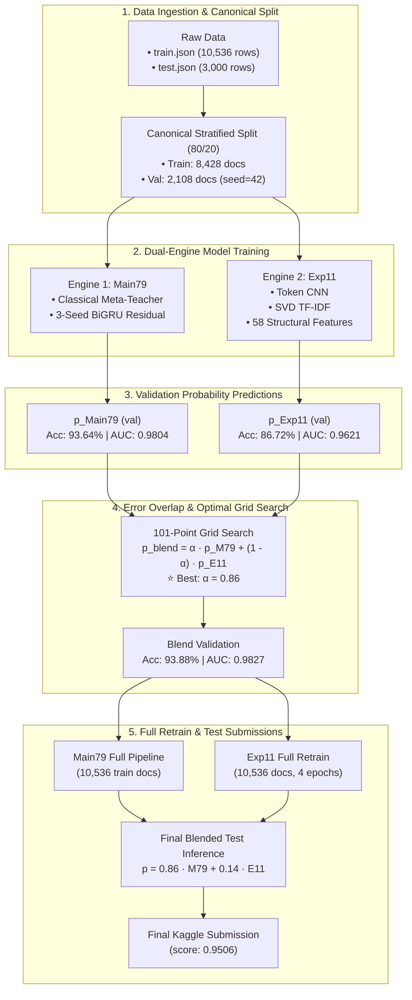
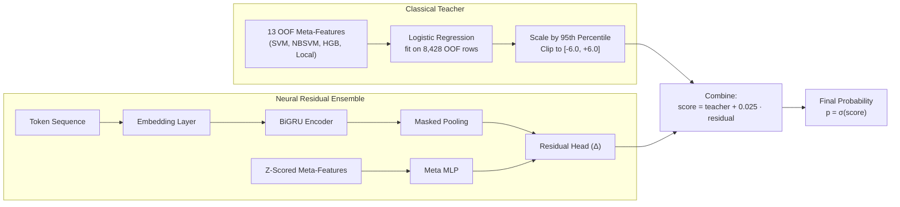
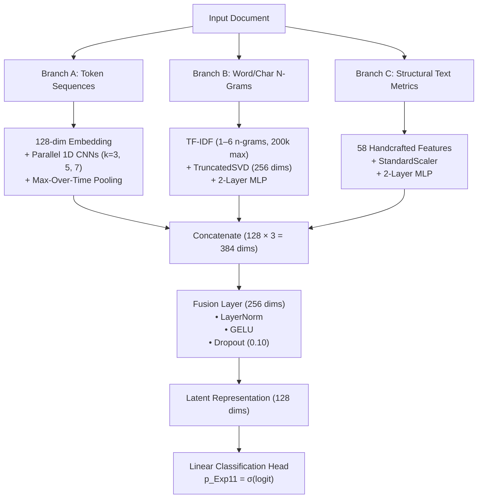

# 🚀 Main79 + Exp11 — Direct Stacking & Ensembling

> **ML4CPMS Project 1:** Human vs. Machine-Generated Text Classification (Kaggle)  
> **Primary Notebook:** [`Main79_Exp11_Direct_Stacking_FINAL.ipynb`](./Main79_Exp11_Direct_Stacking_FINAL.ipynb)

---

## 📊 1. Quick Visual Snapshot

```
┌────────────────────────────────────────────────────────────────────────────────────────┐
│                                 COMPETITION GOAL                                       │
│                Classify documents as Human (Class A) or Machine (Class B)              │
├─────────────────────────┬──────────────────────────┬───────────────────────────────────┤
│ 📁 Train: 10,536 docs   │ 📁 Test: 3,000 docs      │ ⚖️ Canonical Split: 80/20 Stratified│
└─────────────────────────┴──────────────────────────┴───────────────────────────────────┘
```

### 🏆 Score Progression

| Model / Ensemble | Philosophy | Validation Accuracy | Validation ROC-AUC | Kaggle Public Score | Optimal Weight ($\alpha$) |
| :--- | :--- | :---: | :---: | :---: | :---: |
| **Main79 (Reproduced)** | Classical Teacher + Residual BiGRU | `93.64%` | `0.9804` | `0.9500` | 1.00 |
| **Exp11 (Standalone)** | Multi-Input Neural Fusion (CNN + SVD + Stats) | `86.72%` | `0.9621` | — | 0.00 |
| **🌟 Main79 + Exp11 Blend** | **Weighted Probability Ensemble** | **`93.88%`** | **`0.9827`** | **`0.9506` (+0.0006)** | **0.86** |

---

## 🗺️ 2. High-Level Pipeline Flow



---

## 🧠 3. Model 1 — Main79 (Classical Teacher + Residual BiGRU)

Main79 uses a **teacher-residual** formulation. The classical teacher provides strong calibrated baseline margins, while the neural network only learns the remaining residual error.



### 📌 Pointwise Breakdown of Main79:
* **Base Predictors:** SVM, NBSVM, HistGradientBoosting, and local frequency features combined into 13 meta-features.
* **Leakage-Safe Teacher:** 
  * Fits a `LogisticRegression(C=1.0)` on out-of-fold training meta-features (`oof_meta`).
  * Scales raw margins by the 95th percentile and clips logits to `[-6.0, +6.0]`.
* **Neural Residual Architecture:**
  * Bidirectional GRU with masked sequence pooling.
  * Concatenated with an MLP branch over normalized meta-features.
  * Outputs residual adjustment $\Delta \in \mathbb{R}$.
* **3-Seed Ensemble:**
  * Trained over 3 random seeds: `42`, `137`, and `2024` for 4 epochs each.
  * Residuals averaged across seeds.
* **Conservative Shrinkage:**
  * $\text{score} = \text{teacher} + 0.025 \cdot \text{residual}$.
  * The tiny $0.025$ weight prevents neural overfitting and strictly preserves the teacher's calibration.

---

## 🔬 4. Model 2 — Exp11 (Multi-Input Neural Fusion)

Exp11 does not rely on precomputed classical models. It extracts three distinct linguistic modalities in parallel and fuses them.



### 📌 Pointwise Breakdown of Exp11:
* **Branch A (Token Convolutions):**
  * Token sequences capped at 384 tokens.
  * Multi-scale 1D CNN kernels (`3`, `5`, `7`) capture local phrase-level patterns.
* **Branch B (SVD-Compressed TF-IDF):**
  * Sublinear TF-IDF covering n-grams from 1 to 6 (200,000 max features).
  * Compressed via `TruncatedSVD` to 256 dense components to reduce sparsity.
* **Branch C (58 Handcrafted Sequence Features):**
  * **Vocabulary Diversity:** Type-token ratio, token repetition frequency, unique token proportions.
  * **Higher-order Repetition:** Bigram and trigram uniqueness and compression ratios.
  * **Segmental Shannon Entropy:** Information entropy measured across document halves and individual quartiles ($Q_1, Q_2, Q_3, Q_4$).
  * **Structural Lengths:** Token length distributions (mean, std, min, max, boundary lengths).
* **Fusion Head:**
  * Projects concatenated representations down to 128 dimensions with LayerNorm and Dropout.
  * Trained with `AdamW` ($\text{lr} = 2 \times 10^{-3}$) and positive class weighting.
  * Early stopping triggered after 4 epochs based on validation ROC-AUC.

---

## 🎯 5. Why the Blend Works: The Error Disagreement

Main79 and Exp11 view text through completely different lenses:
* **Main79:** Excels at global vocabulary distributions and linear boundary margins.
* **Exp11:** Excels at sentence rhythm, entropy shifts, and phrase-level n-gram structures.

### 🔍 Validation Disagreement Matrix (2,108 docs)

```
                     Exp11 Correct       Exp11 Wrong
                   ┌───────────────────┬───────────────────┐
  Main79 Correct   │   1,787 (84.8%)   │    187 (8.9%)     │
                   ├───────────────────┼───────────────────┤
  Main79 Wrong     │     41 (1.9%)     │     93 (4.4%)     │  <-- 41 examples rescued by Exp11!
                   └───────────────────┴───────────────────┘
```

> [!TIP]
> **Key Insight:** Exp11 correctly classifies **41 documents** that Main79 got wrong. When blended, these rescued predictions push overall validation accuracy from **93.64% $\to$ 93.88%** and yield **+0.0006 on the Kaggle public leaderboard**.

### 📐 The Blending Formula

$$p_{\text{blend}} = 0.86 \cdot p_{\text{Main79}} + 0.14 \cdot p_{\text{Exp11}}$$

$$\hat{y} = \begin{cases} \text{"B"} & \text{if } p_{\text{blend}} \ge 0.50 \\ \text{"A"} & \text{if } p_{\text{blend}} < 0.50 \end{cases}$$

---

## 📖 6. Code Walkthrough: Cell-by-Cell

| Notebook Cell | Purpose | Key Operations | Output / Artifact |
| :---: | :--- | :--- | :--- |
| **Cell 1** | **Asset Verification** | • Auto-detects `main79_stack_bundle.zip`<br/>• Extracts to `main79_stack_runtime/files/`<br/>• Verifies all 11 required files | Populated `PATHS` dictionary |
| **Cell 2** | **Data & Split** | • Parses `train.json` & `test.json`<br/>• Stratified split: 8,428 train / 2,108 val (seed=42) | `train_idx`, `val_idx`, `y_train`, `y_val` |
| **Cell 4** | **Dynamic Import** | • Loads `main79_95_kaggle.py` and `main66.py`<br/>• Reads hyperparameter constants safely | `main79` and `main66` modules |
| **Cell 5** | **Leakage-Safe Teacher** | • Fits Logistic Regression on 13 OOF meta-features<br/>• Computes margins & 95th-percentile scaling | `teacher_val_raw`, `meta_train_z` |
| **Cell 6** | **Main79 Residual Train** | • Trains 3 BiGRU models (seeds 42, 137, 2024)<br/>• Evaluates with $0.025$ shrinkage | `main79_val_prob` (Acc: 93.64%) |
| **Cell 8** | **Exp11 Architecture** | • Builds 58 sequence feature extractor<br/>• Defines `TokenEncoder`, `MLPEncoder`, `FusionModel` | Exp11 PyTorch modules |
| **Cell 9** | **Exp11 Validation** | • Fits TF-IDF + SVD + Scaler on training split<br/>• Trains with early stopping (patience=3) | `exp11_val` (Acc: 86.72%) |
| **Cell 10** | **101-Point Grid Search** | • Evaluates $\alpha \in [0.0, 1.0]$ in increments of 0.01<br/>• Computes disagreement matrix | Best $\alpha = 0.86$ (Acc: 93.88%) |
| **Cell 12** | **Main79 Full Inference** | • Runs standalone `main79_95_kaggle.py`<br/>• Fits all 10,536 docs $\to$ predicts 3,000 test docs | `main79_test_prob` (shape: 3000,) |
| **Cell 13** | **Exp11 Full Retrain** | • Re-fits TF-IDF + SVD on all 10,536 docs<br/>• Retrains for 4 epochs $\to$ predicts 3,000 test docs | `exp11_test_prob_B` (shape: 3000,) |
| **Cell 15** | **Submission Generation** | • Applies $\alpha = 0.86$ blend formula<br/>• Validates shape, uniqueness, and class balance | 3 CSV submissions in `Results/` |

---

## 🏃 7. How to Run

### Option A: Local Execution (JupyterLab / Notebook)
1. Ensure `main79_stack_bundle.zip` is present in this directory.
2. Open [`Main79_Exp11_Direct_Stacking_FINAL.ipynb`](./Main79_Exp11_Direct_Stacking_FINAL.ipynb).
3. Select **Kernel $\to$ Restart and Run All Cells**.
4. The notebook will automatically find the zip archive, unpack it, and complete execution in ~5–7 minutes on GPU.

### Option B: Google Colab
1. Upload [`Main79_Exp11_Direct_Stacking_FINAL.ipynb`](./Main79_Exp11_Direct_Stacking_FINAL.ipynb) to Google Colab.
2. Switch runtime type to **GPU** (T4 or higher).
3. Upload `main79_stack_bundle.zip` to `/content/` via the Colab files sidebar.
4. Click **Runtime $\to$ Run all**.

---

## 📁 8. Generated Outputs & Submissions

All submissions are written to the [`Results/`](./Results/) directory:

| Filename | Description | Class A Count | Class B Count | Kaggle Public Score |
| :--- | :--- | :---: | :---: | :---: |
| [`submission_main79_reproduced.csv`](./Results/submission_main79_reproduced.csv) | Main79 Standalone Pipeline | 1,048 | 1,952 | `0.9500` |
| [`submission_exp11.csv`](./Results/submission_exp11.csv) | Exp11 Standalone Neural Pipeline | 1,326 | 1,674 | — |
| [`submission_main79_exp11_blend.csv`](./Results/submission_main79_exp11_blend.csv) | **Final Winning Ensemble Blend ($\alpha = 0.86$)** | **1,074** | **1,926** | **`0.9506`** |
